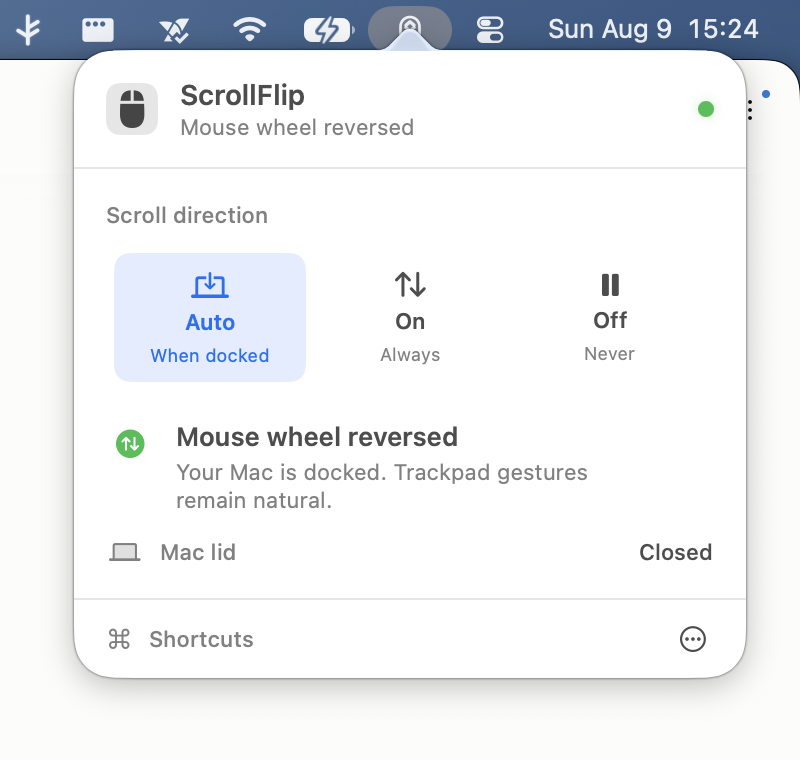
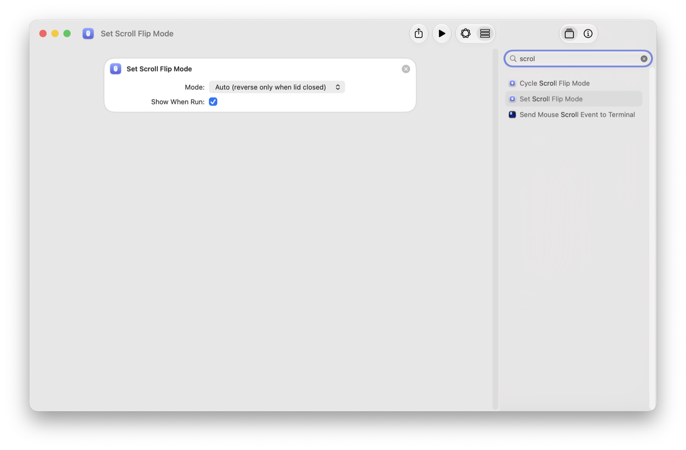

# ScrollFlip


Reverse scroll direction for a wheel mouse while keeping natural scrolling on the trackpad, on macOS.



This repo has two builds that share the same engine and the same `~/.scrollflip/mode` file:

- **CLI** (`scrollflip.swift`): one Swift file built with `swiftc`. A LaunchAgent runs it and you control it from the terminal. No app bundle.
- **App** (`app/`): a signed, Dock-less menu bar app built with Xcode. Its native popover shows the current mode, lid state, scroll-engine status, and permission recovery. App Intents expose the same controls to Shortcuts, Spotlight, and Siri.

Run one at a time. Both install a scroll event tap, and two taps cancel each other out.

## Why

macOS has one scroll direction setting for every pointing device. The "Natural scrolling" checkbox in the Trackpad pane and the one in the Mouse pane write the same value, so you cannot set natural scrolling for the trackpad and reversed scrolling for a mouse at the same time. scrollflip gives you both without changing any system setting.

## How it works

scrollflip installs a scroll event tap. A trackpad and a Magic Mouse send continuous, pixel based scroll events. A wheel mouse sends line based events. scrollflip inverts only the line based events, so the mouse reverses and the trackpad is left alone.

Both builds read a one-word mode file. The CLI can run as a per-user LaunchAgent; the app runs only when opened manually:

- `auto`: reverse the mouse only when the laptop lid is closed (docked or clamshell)
- `on`: always reverse the mouse
- `off`: do nothing

Keep the system "Natural scrolling" setting turned on. scrollflip handles the mouse.

## CLI

The CLI is the lean version: one file, no app bundle, terminal control.

### Requirements

- macOS 12 or later
- Swift toolchain (Xcode, or the Command Line Tools: `xcode-select --install`)

### Build

```
swiftc -O scrollflip.swift -o scrollflip -framework CoreGraphics -framework IOKit
```

### Install

```
./scrollflip install
```

This writes `~/Library/LaunchAgents/scrollflip.plist` and loads it. The agent starts at login.

### Grant Accessibility

A scroll event tap needs Accessibility permission.

1. Open System Settings, then Privacy & Security, then Accessibility
2. Click the plus button
3. Press Command Shift G, type the full path to the built `scrollflip` binary, and add it
4. Turn the switch on

Check that it is running:

```
./scrollflip status
```

`flipping=yes` with an empty `~/.scrollflip/scrollflip.log` means the tap is active.

The Accessibility grant is tied to the exact binary. If you rebuild scrollflip, remove the old entry in the Accessibility list and add the new binary again.

### Use

```
scrollflip auto      reverse the mouse only when the lid is closed
scrollflip on        always reverse the mouse
scrollflip off       stop reversing
scrollflip cycle     auto, then on, then off, then back to auto
scrollflip status    show mode, lid state, and current behavior
```

### Shell alias

Add this to `~/.zshrc` so you can run it from any terminal. Point it at the path where your binary lives.

```
alias scrollflip="$HOME/.scrollflip/scrollflip"
```

### Menu bar toggle

Use the Shortcuts app to get a menu bar control and a keyboard shortcut.

1. Open Shortcuts and create a new shortcut named Scroll Flip
2. Add the action Run Shell Script and set it to `$HOME/.scrollflip/scrollflip cycle`
3. Add the action Show Notification and pass it the result of the script
4. Open the shortcut details, turn on Pin in Menu Bar, and add a keyboard shortcut if you want one

Some macOS versions offer to generate a shortcut from a written description. In practice the generator skips the Run Shell Script action, so the manual steps above are the reliable way to build this one.

### Uninstall

```
./scrollflip uninstall
```

This unloads and removes the LaunchAgent. The mode file stays in `~/.scrollflip`. Delete that folder to remove everything.

## App (native menu bar control, Shortcuts, Siri)

The app is a Dock-less menu bar utility that runs the same tap and adds:

- A compact native control panel for Auto, On, and Off.
- Live feedback for the active mode, lid position, event-tap health, and Accessibility permission.
- One-click permission recovery with a clear explanation of what the app can access.
- App Intents, so `Set ScrollFlip Mode` and `Cycle ScrollFlip Mode` appear in Shortcuts and Spotlight, with a Siri phrase. This metadata requires a signed app bundle and is not available to the loose CLI binary.



### Requirements

- macOS 14 or later
- Xcode (not just the Command Line Tools)
- A code signing identity. List yours with `security find-identity -v -p codesigning`.

### Build

```
cd app
xcodebuild -project ScrollFlip.xcodeproj -target ScrollFlip -configuration Release \
  SYMROOT="$PWD/build" CODE_SIGNING_ALLOWED=NO build
codesign --force --options runtime --timestamp=none \
  --sign "Apple Development: YOUR NAME (TEAMID)" build/Release/ScrollFlip.app
```

Sign with your own Development identity. The Accessibility grant is then tied to the signature instead of the binary hash, so it survives rebuilds. An ad hoc signature loses the grant on every build.

### Install

```
ditto app/build/Release/ScrollFlip.app /Applications/ScrollFlip.app
```

ScrollFlip does not install a LaunchAgent or add itself to Login Items. Open it manually from Applications whenever you want to use it.

On first launch the app asks for Accessibility permission. Approve it, or use **Open Settings** in the popover. ScrollFlip changes mouse-wheel events only; it never reads clicks or keystrokes. The menu bar icon turns active once the tap is running.

### Use

- Menu bar: click the mouse icon, pick Auto, On, or Off, and see exactly what ScrollFlip is doing.
- Shortcuts: search Scroll Flip in the Shortcuts app for the Set and Cycle actions.
- Siri or Spotlight: say or type Cycle Scroll Flip.

## Notes

- Only wheel mice are reversed. If you use a mouse with a high resolution or free spinning wheel and a driver that sends continuous scroll events, scrollflip treats it like a trackpad and leaves it alone.
- scrollflip never changes the system scroll setting. It only edits scroll events in flight.

## License

MIT
